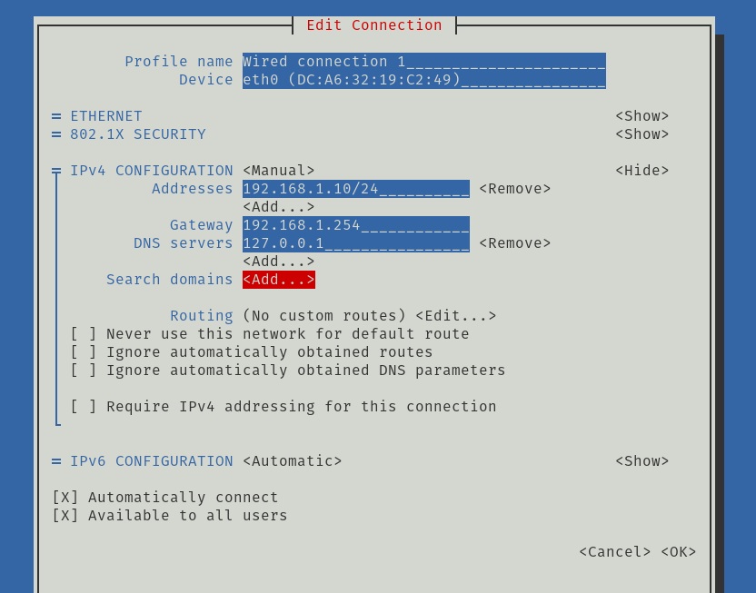
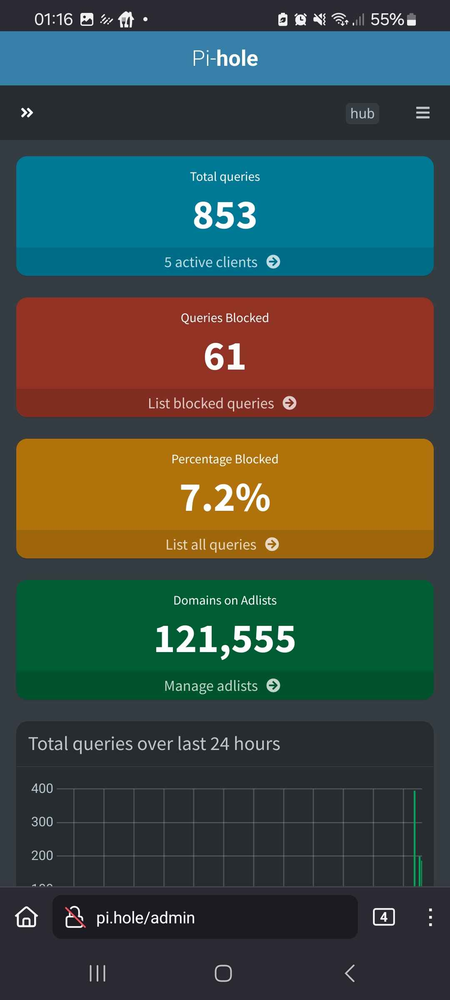
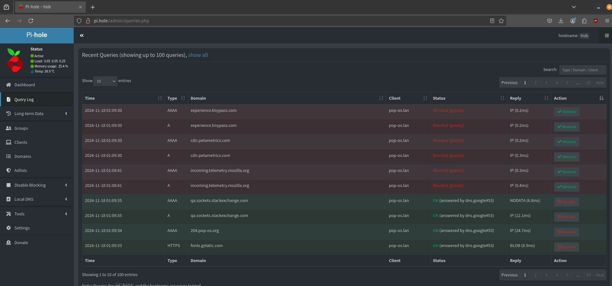
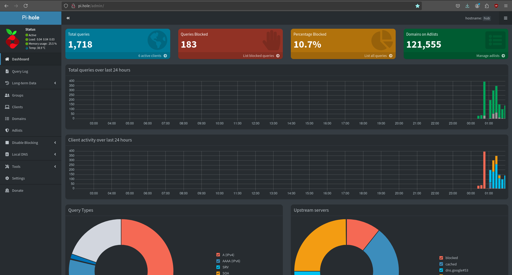

# hub

## Prerequisites

- Docker
    ```bash
    curl -sSL https://get.docker.com | sh
    sudo usermod -aG docker $USER
    ```

- [Docker compose](https://docs.docker.com/compose/install/linux/)

    ```bash
    sudo apt update
    sudo apt install docker-compose-plugin
    ```

- Rasbperry Pi

- Raspbian OS

## Remote access

### Find the local IPV4 address

`hostname -I`

`nmcli device show`

`ping raspberrypi.local`


### Enable ssh

    Enter sudo raspi-config in a terminal window.

    Select Interfacing Options.

    Navigate to and select SSH.

    Choose Yes.

    Select Ok.

    Choose Finish.

### Connect to ssh

`ssh <username>@<ip address>`


## Install

Docker & Docker Compose installed

Run `docker compose up -d`


```bash
$ docker compose up -d
[+] Running 10/10
 ✔ pihole Pulled                                                                                                                                 12.0s 
   ✔ f7b75fe1f735 Pull complete                                                                                                                   7.5s 
   ✔ ae7fa90428da Pull complete                                                                                                                   9.4s 
   ✔ 4f4fb700ef54 Pull complete                                                                                                                   9.5s 
   ✔ 8c787996586d Pull complete                                                                                                                   9.5s 
   ✔ 7b080c59c7ae Pull complete                                                                                                                   9.6s 
   ✔ d1c69889e539 Pull complete                                                                                                                   9.6s 
   ✔ 582a233ebf1f Pull complete                                                                                                                  10.3s 
   ✔ 4b0e1e0d51cd Pull complete                                                                                                                  10.3s 
   ✔ 04dc5d27d0a6 Pull complete                                                                                                                  10.4s 
[+] Running 1/2
 ✔ Network pi_default  Created                                                                                                                    0.1s 
 ⠹ Container pihole    Starting                                                                                                                   0.1s 
Error response from daemon: driver failed programming external connectivity on endpoint pihole (<HASH>): failed to bind port 0.0.0.0:53/tcp: Error starting userland proxy: listen tcp4 0.0.0.0:53: bind: address already in use
```

### Check what is blocking the port, and unblock


`sudo lsof -i -P -n | grep LISTEN`

```bash
$ sudo lsof -i -P -n | grep LISTEN
systemd-r   641 systemd-resolve   14u  IPv4  11571      0t0  TCP 127.0.0.53:53 (LISTEN)
...
```

systemd-resolved is a service that provides network name resolution to local applications. It is part of the systemd suite and is responsible for resolving DNS queries, caching DNS results, and providing a local DNS resolver. By default, it listens on port 53, which is the standard port for DNS.

After confirming what is blocking us from starting our container, we can disable this.

> Note, do this with caution, we will be disabling DNS resolutions locally while we continue setting this up. Unless you have memorised google's IP, good luck. (Time of writing: 142.250.200.46)

`sudo systemctl stop systemd-resolved`

We can of course bring the service back with the restart argument.

`sudo systemctl restart systemd-resolved`

Now run `docker compose up -d` again and the output should look more like this.

```bash
$ docker compose up -d
[+] Running 1/1
 ✔ Container pihole  Started 
```

### Keeping DNS servers

Disable systemd-resolved from starting on boot.

`sudo systemctl disable systemd-resolved`

Remove the symlink if it already exists

`sudo rm /etc/resolv.conf`

Create a new `resolv.conf` pointing to your Pi-hole install (localhost)

`echo "nameserver 127.0.0.1" | sudo tee /etc/resolv.conf`


We can confirm the container is running by using the `docker ps` command. The flag `-a` lists all containers, including those not currently running.

```
$ docker ps -a
CONTAINER ID   IMAGE                  COMMAND      CREATED          STATUS                   PORTS                                                                                                                                        NAMES
90513f9e8ec5   pihole/pihole:latest   "/s6-init"   15 minutes ago   Up 2 minutes (healthy)   0.0.0.0:53->53/udp, :::53->53/udp, 0.0.0.0:53->53/tcp, :::53->53/tcp, 0.0.0.0:80->80/tcp, 0.0.0.0:67->67/udp, :::80->80/tcp, :::67->67/udp   pihole
c233cd915df1   hello-world            "/hello"     4 days ago       Exited (0) 4 days ago                                                                                                                                                 festive_elgamal
```

If you haven't set a password using the `WEBPASSWORD` env variable, one will have been generated for you. We can use grep to filter the logs for this password.

`docker logs pihole | grep random`


### Set a static IP

To set up a static IP address on a Raspberry Pi 4 using the latest Raspberry Pi OS, follow these steps:

    Open the terminal on your Raspberry Pi or connect via SSH.
    Use the network manager tool (nmtui) to configure the static IP. Enter the following command:

`sudo nmtui`



1. In the text-based interface that appears, select "Edit a connection" and press Enter.
2. Choose the network connection you want to modify (e.g., "Wired connection 1" for Ethernet or your Wi-Fi network name).
3. Navigate to "IPv4 CONFIGURATION" and change it from "Automatic" to "Manual"
4. Select "Show" next to the IPv4 CONFIGURATION and press Enter.
5. Fill in the following fields:
    - Addresses: Enter the desired static IP address for your Raspberry Pi (e.g., 192.168.1.100/24)
    - Gateway: Enter your router's IP address (e.g., 192.168.1.1)
    - DNS servers: Enter your preferred DNS server IP (e.g., 8.8.8.8 for Google's DNS)
6. Use the Tab key to navigate to "OK" and press Enter to save the changes.
7. Select "Back" and then "Quit" to exit nmtui.
8. Reboot your Raspberry Pi for the changes to take effect:

`sudo reboot`

After the reboot, your Raspberry Pi should have the static IP address you configured. You can verify this by checking the IP address:

bash
hostname -I

### Enable DHCP

To make the raspberry PI the authorative controller of assigned IPs, we'll need to remove the ability from our router, and enable the ability in PiHole.

Using non overlapping IPs we can ensure we don't use an IP in use already.

Stepping back to a computer on our network, now we've made a significant network change, we need our computers to recongnise it.

### Release and reassign a local IP

Release the IPV4 address

`sudo dhclient -r`

Check that it's been released

`ip addr show`

Request a new IP address from the DHCP server

`sudo dhclient`


### Flush the DNS cache

`sudo resolvectl flush-caches`

Check if systemd-resolved is running:
Verify if the systemd-resolved service is active on your system

`sudo systemctl status systemd-resolved`

If it's not running, you can try to enable and start it:

`sudo systemctl enable --now systemd-resolved`

Now you should have your local DNS & DHCP server configured correctly.

Navigate to http://pi.hole/admin from any device on your network.







You may need to flush the cache & reassign your IP on other devices.